## How to run the app

1   -   Create a new project on Firebase

2   -   Add an Android app to the project

3   -   Download the `google-services.json` file and add it to the app directory

4   -   create a file named 'app/src/main/res/values/strings.xml' and add your client id and gemini api key as shown below


```xml
<?xml version="1.0" encoding="utf-8"?>
<resources>
    <string name="app_name">ConvoAI</string>
    <string name="app_logo">app logo</string>
    <string name="app_desc">Using this software,you can ask you questions and receive articles using artificial intelligence assistant</string>
    <string name="hello_blank_fragment">Hello</string>

    <!-- IMPORTENT -->
    <string name="default_web_client_id">YOUR_FIREBASE_CLIENT_ID</string>
    <string name="gemini_api_key">YOUR_GEMINI_API_KEY</string>
</resources>
```

# Mobile Application Screenshots

## Light Mode

| Splash Screen                                       | Welcome Screen                                        | Login Screen                                      | Register Screen                                         |
| --------------------------------------------------- | ----------------------------------------------------- | ------------------------------------------------- | ------------------------------------------------------- |
| 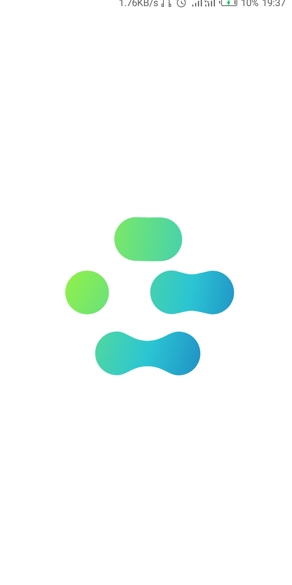 | 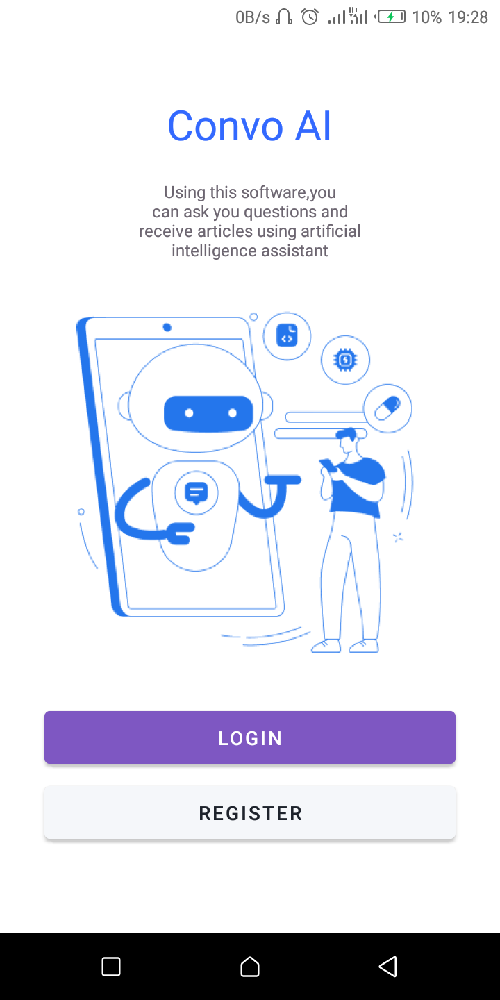 | 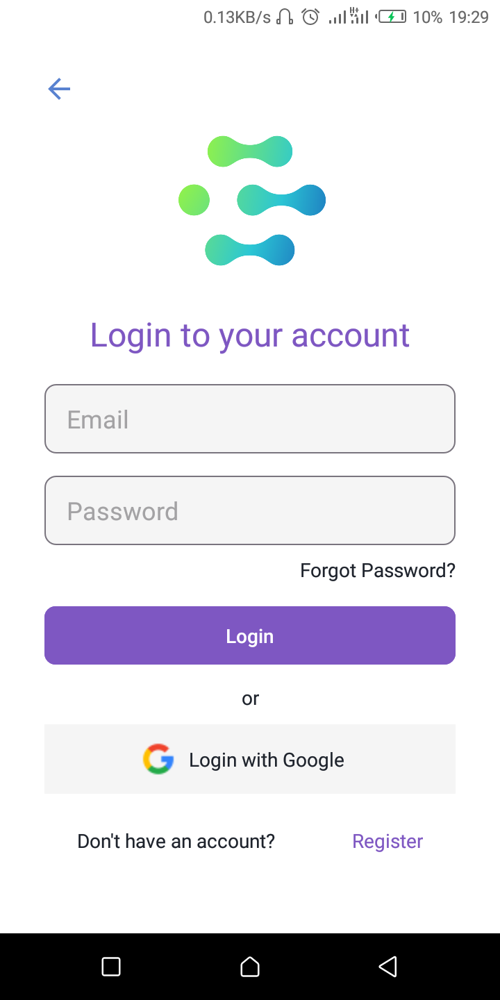 | 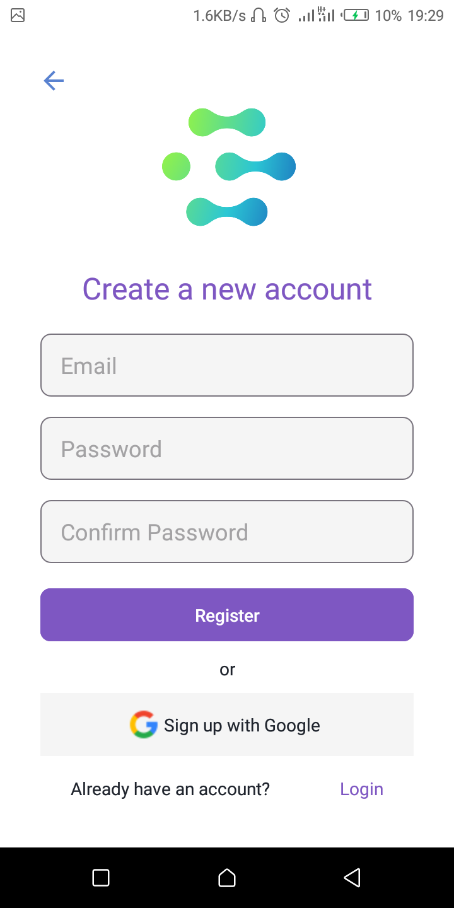 |

| Forgot Password Screen                                                | Home Screen                                     | History Screen                                        | Profile Screen                                        | Chat Screen                                  |
| --------------------------------------------------------------------- | ----------------------------------------------- | ----------------------------------------------------- | ----------------------------------------------------- |-------------------------------------------- |
| 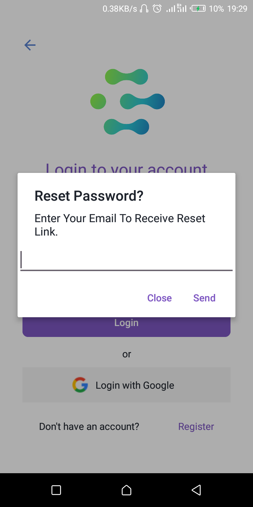 | 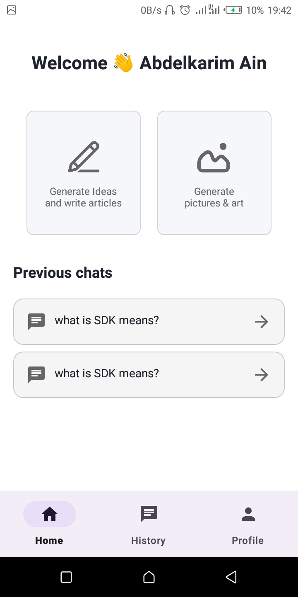 | 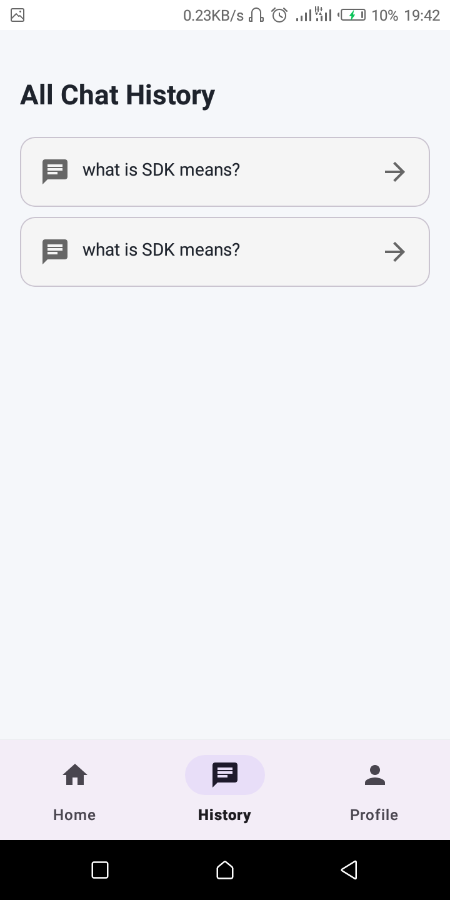 | 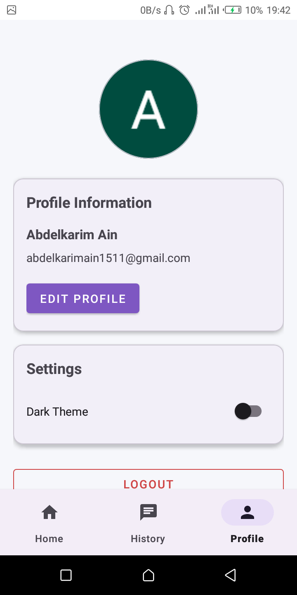 | 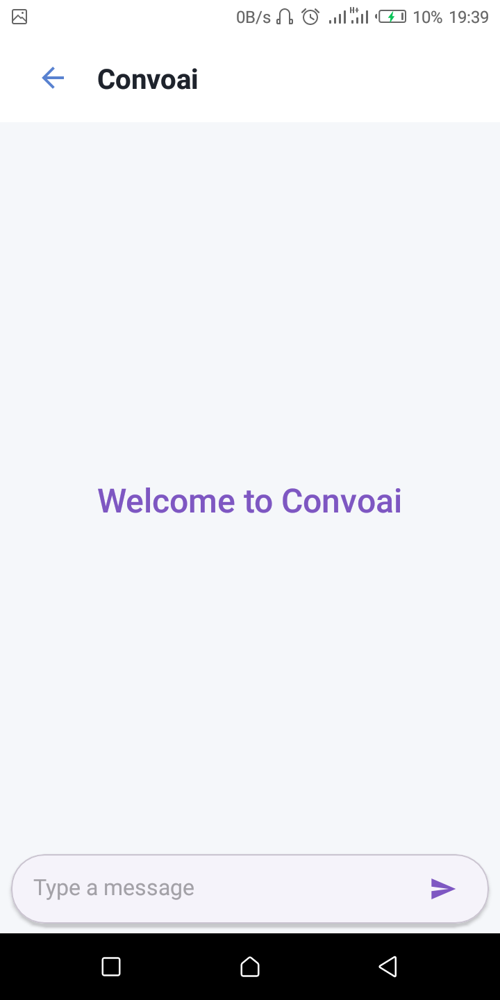 |


---

## Dark Mode

| Splash Screen                                            | Welcome Screen                                             | Login Screen                                    | Register Screen                                              |
| -------------------------------------------------------- | ---------------------------------------------------------- | ----------------------------------------------- | ------------------------------------------------------------ |
| 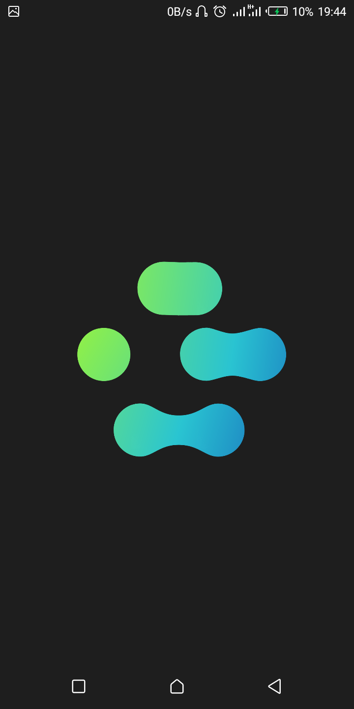 | 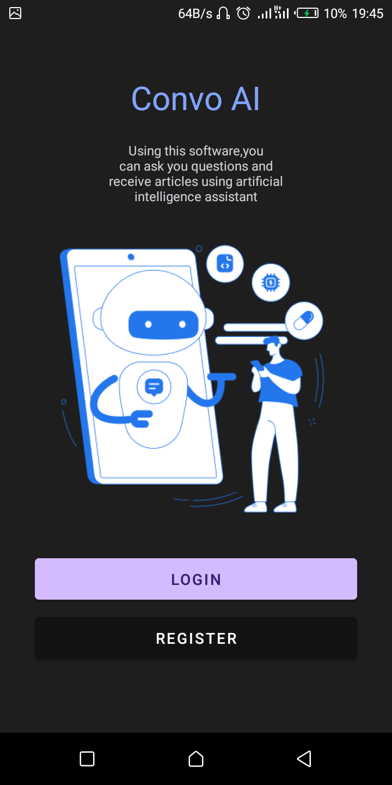 | 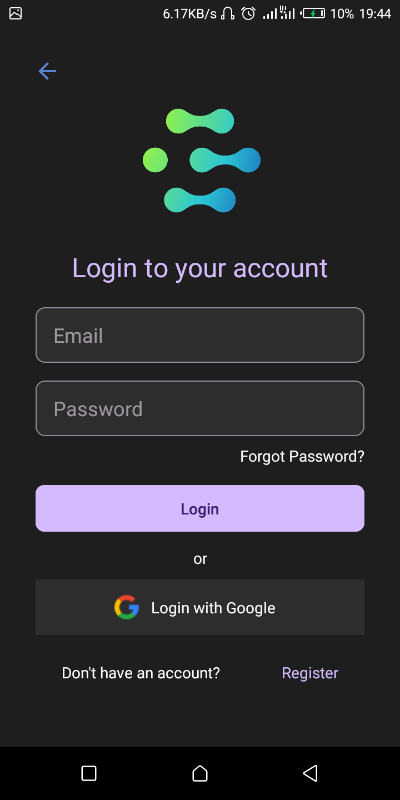 | 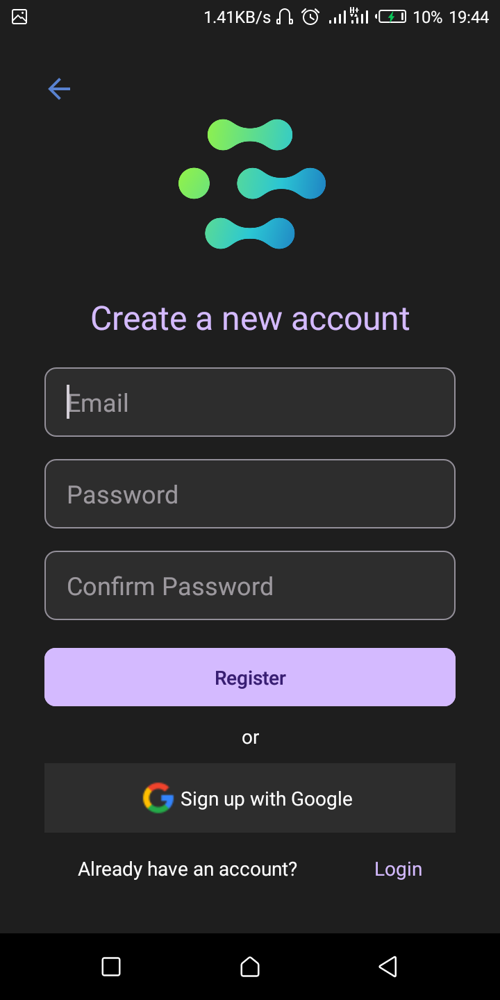 |

| Forgot Password Screen                                              | Home Screen                                          | History Screen                                             | Profile Screen                                             | Chat Screen                                          |
| ------------------------------------------------------------------- | ---------------------------------------------------- | ---------------------------------------------------------- | ---------------------------------------------------------- | ---------------------------------------------------- |
| 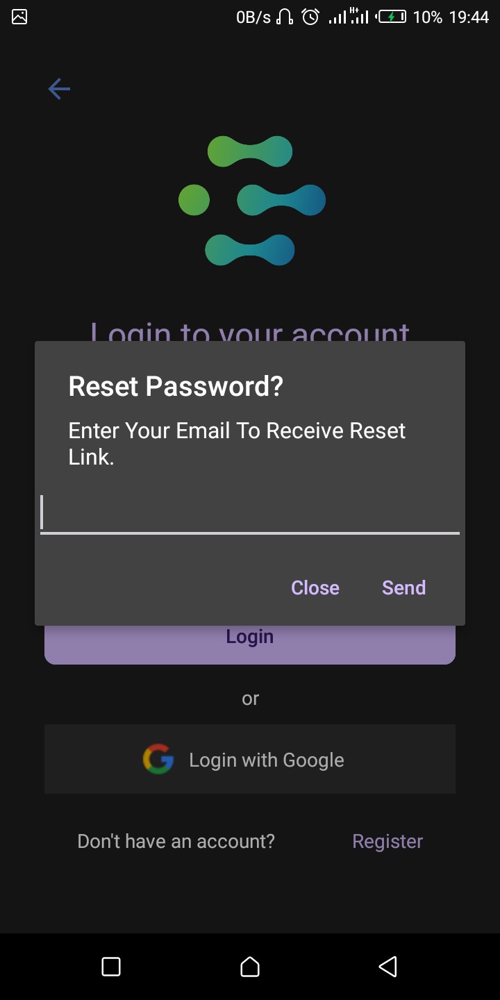 | 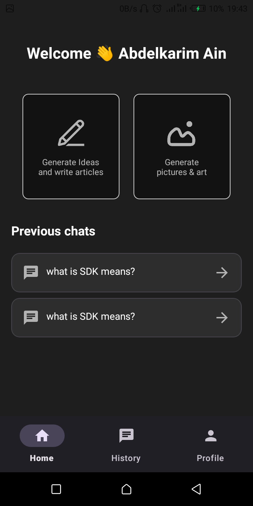 | 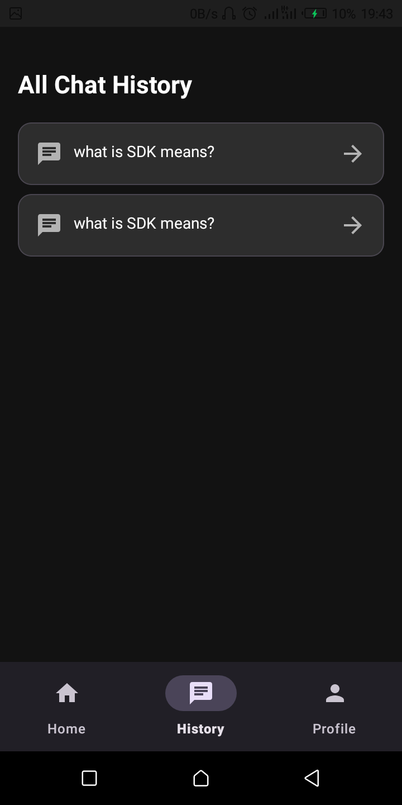 | 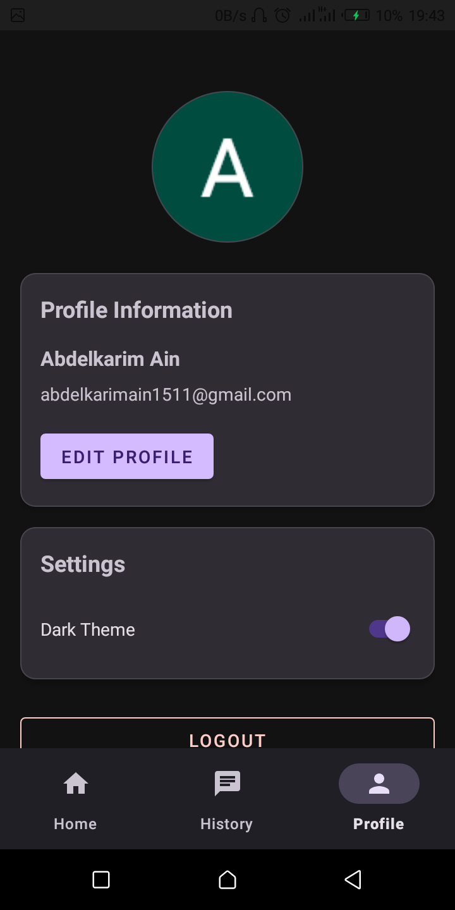 | 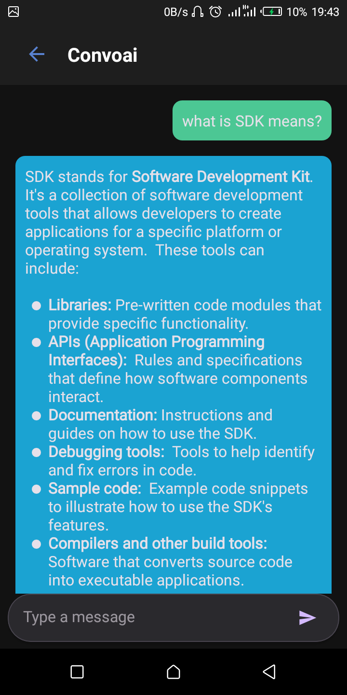 |
